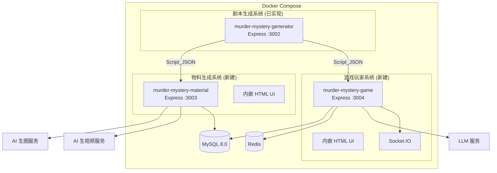
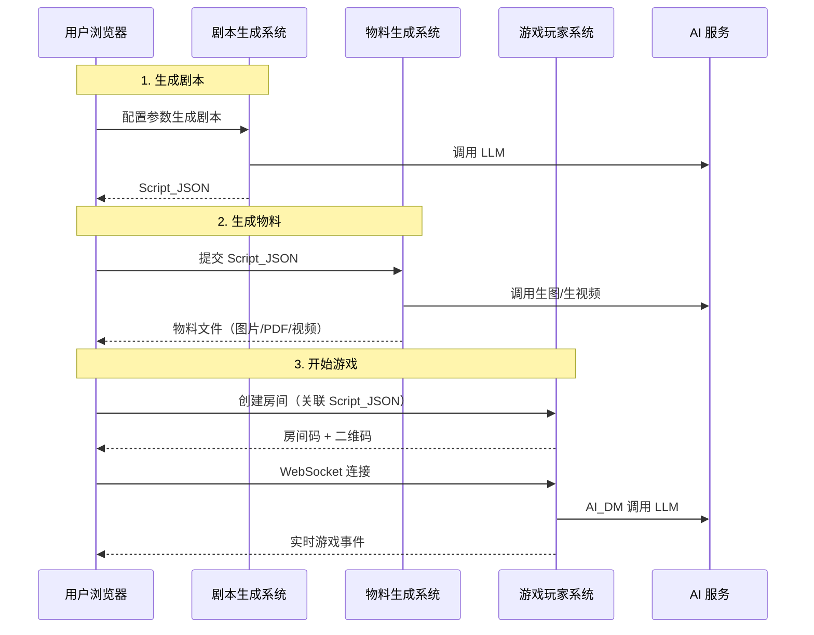

# 设计文档：剧本杀三系统平台

## 概述

本平台由三个独立的 Node.js + Express 系统组成，通过 Script_JSON 数据格式连接：

1. **剧本生成系统**（已实现，`murder-mystery-generator`）：AI 生成剧本杀 JSON 数据
2. **物料生成系统**（新建）：读取 Script_JSON，调用 AI 服务生成可视化物料
3. **游戏玩家系统**（新建）：Web 游玩平台，支持房间管理、选角、AI 主持

设计原则：**KISS**。每个系统是独立的 Express 应用，内嵌简单 HTML 页面（Bootstrap 5 CDN），不使用前端框架。三个系统通过 Docker Compose 统一部署，共享 MySQL 和 Redis。

### 关键设计决策

| 决策 | 选择 | 理由 |
|------|------|------|
| 前端方案 | Express 内嵌 HTML + Bootstrap 5 CDN | KISS 原则，参照 murder-mystery-generator 的 UI 实现 |
| 系统间通信 | Script_JSON 文件/API 传递 | 三系统独立，不需要事件总线 |
| 数据库 | MySQL 8.0（共享实例，独立数据库） | 简单可靠 |
| 实时通信 | Socket.IO | 游戏系统需要实时推送 |
| AI 调用 | 统一 LLM 适配器接口 | 复用 murder-mystery-generator 的模式 |
| 共享类型 | `@gdgeek/murder-mystery-shared` npm 包 | 已有，直接复用 |

## 架构

### 系统架构图



### 请求流程



## 组件与接口

### 1. 剧本生成系统（已实现，作为依赖）

已实现于 `murder-mystery-generator` 仓库。本平台通过以下方式使用：

- 导入 `@gdgeek/murder-mystery-shared` 包获取 TypeScript 类型定义
- 通过 REST API（`GET /api/scripts/:id/export`）获取 Script_JSON
- 或直接上传 Script_JSON 文件

关键类型（来自 `@gdgeek/murder-mystery-shared`）：

```typescript
// Script_JSON 顶层结构
interface Script {
  id: string;
  config: ScriptConfig;
  dmHandbook: DMHandbook;
  playerHandbooks: PlayerHandbook[];
  materials: Material[];
  branchStructure: BranchStructure;
  playableStructure?: PlayableStructure;  // 可选：按幕组织的可游玩结构
}
```

> **PlayableStructure（可游玩结构）**：剧本生成系统新增的可选输出，将剧本内容按"幕"重组为线性可游玩序列：序幕（Prologue）→ 多个中间幕（Act[]）→ 终幕（Finale）。每幕包含故事叙述、搜证目标、交流建议和投票/决策。DM手册和玩家手册各自按幕组织。详见下方"可游玩结构类型定义"。

#### 1.1 可游玩结构类型定义（PlayableStructure）

可游玩结构将剧本内容按"幕"重组为线性可游玩序列，包含双视角（DM + 玩家）的幕结构。中间幕数量等于 `config.roundStructure.totalRounds`。

```typescript
// ─── 可游玩结构顶层 ───
interface PlayableStructure {
  prologue: Prologue;                          // 序幕
  acts: Act[];                                 // 中间幕（数量 = totalRounds）
  finale: Finale;                              // 终幕
  dmHandbook: PlayableDMHandbook;              // DM可游玩手册
  playerHandbooks: PlayablePlayerHandbook[];   // 玩家可游玩手册
}

// ─── 序幕 ───
interface Prologue {
  backgroundNarrative: string;   // 故事背景叙述
  worldSetting: string;          // 世界观描述
  characterIntros: CharacterIntro[];
}

interface CharacterIntro {
  characterId: string;
  characterName: string;
  publicDescription: string;     // 公开的角色简介
}

// ─── 幕（Act）───
interface Act {
  actIndex: number;              // 从1开始
  title: string;
  narrative: string;             // 全局故事叙述（DM朗读）
  objectives: string[];          // 搜证目标
  clueIds: string[];             // 本幕分发的线索ID
  discussion: ActDiscussion;     // 交流建议
  vote: ActVote;                 // 投票/决策
}

interface ActDiscussion {
  topics: string[];              // 讨论话题列表
  guidingQuestions: string[];    // 引导问题
  suggestedMinutes: number;      // 建议讨论时长
}

interface ActVote {
  question: string;              // 投票问题
  options: ActVoteOption[];      // 选项列表
}

interface ActVoteOption {
  id: string;
  text: string;                  // 选项文本
  impact: string;                // 对后续剧情的影响描述
  nextNodeId?: string;           // 关联分支节点（可选）
}

// ─── 终幕 ───
interface Finale {
  finalVote: ActVote;            // 最终投票（如凶手指认）
  truthReveal: string;           // 真相揭示文本
  endings: FinaleEnding[];
}

interface FinaleEnding {
  endingId: string;
  name: string;
  triggerCondition: string;
  narrative: string;
  playerEndingSummaries: { characterId: string; ending: string }[];
}

// ─── DM可游玩手册 ───
interface PlayableDMHandbook {
  prologueGuide: PrologueGuide;
  actGuides: ActGuide[];
  finaleGuide: FinaleGuide;
}

interface PrologueGuide {
  openingScript: string;         // 开场白文本
  characterAssignmentNotes: string;
  rulesIntroduction: string;
}

interface ActGuide {
  actIndex: number;
  readAloudText: string;         // DM朗读文本
  keyEventHints: string[];       // 关键事件提示
  clueDistributionInstructions: PlayableClueDistributionInstruction[];
  discussionGuidance: string;    // 交流环节引导
  voteHostingNotes: string;      // 投票主持说明
  dmPrivateNotes: string;        // DM私密备注
}

interface PlayableClueDistributionInstruction {
  clueId: string;
  targetCharacterId: string;
  condition: string;             // 分发条件
}

interface FinaleGuide {
  finalVoteHostingFlow: string;
  truthRevealScript: string;     // 真相揭示朗读文本
  endingJudgmentNotes: string;   // 结局判定说明
}

// ─── 玩家可游玩手册 ───
interface PlayablePlayerHandbook {
  characterId: string;
  characterName: string;
  prologueContent: PlayerPrologueContent;
  actContents: PlayerActContent[];
  finaleContent: PlayerFinaleContent;
}

interface PlayerPrologueContent {
  characterId: string;
  backgroundStory: string;
  relationships: CharacterRelationship[];
  initialKnowledge: string[];    // 初始已知信息
}

interface PlayerActContent {
  actIndex: number;
  characterId: string;
  personalNarrative: string;     // 角色视角故事片段
  objectives: string[];          // 本幕行动目标
  clueHints: string[];           // 线索提示
  discussionSuggestions: string[];
  secretInfo: string;            // 本幕私密信息
}

interface PlayerFinaleContent {
  characterId: string;
  closingStatementGuide: string; // 最终陈述指引
  votingSuggestion: string;      // 投票建议
}
```

**迁移支持**：提供 `MigrationService` 将旧版 Script（无 playableStructure）转换为新结构，映射规则：
- `dmHandbook.overview` → `prologue.backgroundNarrative`
- `dmHandbook.roundGuides[i]` → `actGuides[i]`
- `dmHandbook.branchDecisionPoints` → 按 `roundIndex` 映射到 `acts[i].vote`
- `dmHandbook.clueDistribution` → 按 `roundIndex` 分组到 `acts[i].clueIds`
- `playerHandbook.roundActions[i]` → `playerActContents[i]`
- `dmHandbook.truthReveal` → `finale.truthReveal`
- `dmHandbook.endings` → `finale.endings`

### 2. 物料生成系统

#### 2.1 系统结构

```
murder-mystery-material/
├── src/
│   ├── server.ts                 # Express 入口
│   ├── app.ts                    # Express 应用配置
│   ├── db/
│   │   ├── mysql.ts              # MySQL 连接
│   │   └── migrations/           # SQL 迁移文件
│   ├── services/
│   │   ├── material-job.service.ts    # 任务管理核心
│   │   ├── cover-generator.ts         # 封面生成
│   │   ├── script-pdf-generator.ts    # PDF 生成
│   │   ├── clue-card-generator.ts     # 线索卡生成
│   │   ├── ending-video-generator.ts  # 结局视频生成
│   │   └── asset-storage.ts           # 文件存储
│   ├── adapters/
│   │   ├── image-ai.adapter.ts   # AI 生图适配器
│   │   └── video-ai.adapter.ts   # AI 生视频适配器
│   ├── routes/
│   │   ├── api.ts                # REST API 路由
│   │   └── ui/                   # 内嵌 HTML UI
│   │       ├── index.html
│   │       ├── styles.css
│   │       └── app.js
│   └── validators/
│       └── script-json.validator.ts  # Script_JSON 校验
├── storage/                      # 本地文件存储目录
├── Dockerfile
└── package.json
```

#### 2.2 核心服务接口

```typescript
// ===== 物料任务管理 =====

enum SubTaskType {
  COVER = 'cover',
  PLAYER_PDF = 'player_pdf',
  DM_PDF = 'dm_pdf',
  CLUE_CARD = 'clue_card',
  ENDING_VIDEO = 'ending_video'
}

enum TaskStatus {
  PENDING = 'pending',
  PROCESSING = 'processing',
  COMPLETED = 'completed',
  FAILED = 'failed'
}

interface MaterialJob {
  id: string;
  scriptJsonId: string;
  status: TaskStatus;
  subTasks: SubTask[];
  createdAt: Date;
  updatedAt: Date;
}

interface SubTask {
  id: string;
  jobId: string;
  type: SubTaskType;
  referenceId: string;      // 关联的角色ID/线索ID/结局ID
  status: TaskStatus;
  resultPath: string | null;
  errorMessage: string | null;
  createdAt: Date;
  updatedAt: Date;
}

interface IMaterialJobService {
  createJob(scriptJson: Script): Promise<MaterialJob>;
  getJob(jobId: string): Promise<MaterialJob | null>;
  getSubTasks(jobId: string): Promise<SubTask[]>;
  retrySubTask(subTaskId: string): Promise<SubTask>;
  executeJob(jobId: string): Promise<void>;
}
```

```typescript
// ===== 各生成器接口 =====

interface ICoverGenerator {
  generate(script: Script): Promise<string>;  // 返回文件路径
}

interface IScriptPdfGenerator {
  generatePlayerPdf(handbook: PlayerHandbook, scriptTitle: string): Promise<string>;
  generateDmPdf(dmHandbook: DMHandbook, scriptTitle: string): Promise<string>;
}

interface IClueCardGenerator {
  generate(clueCard: ClueCard): Promise<string>;  // 返回文件路径
}

interface IEndingVideoGenerator {
  generate(ending: Ending): Promise<string>;  // 返回文件路径
}
```

```typescript
// ===== 资源存储 =====

interface IAssetStorage {
  save(jobId: string, fileName: string, data: Buffer): Promise<string>;
  getFilePath(jobId: string, fileName: string): string;
  listFiles(jobId: string): Promise<AssetFileInfo[]>;
  createZip(jobId: string): Promise<Buffer>;
}

interface AssetFileInfo {
  fileName: string;
  type: SubTaskType;
  size: number;
  status: TaskStatus;
  url: string;
}
```

```typescript
// ===== AI 适配器 =====

interface IImageAIAdapter {
  generateImage(prompt: string): Promise<Buffer>;
}

interface IVideoAIAdapter {
  generateVideo(prompt: string, durationSeconds: number): Promise<Buffer>;
}
```

```typescript
// ===== Script_JSON 校验 =====

interface ValidationResult {
  valid: boolean;
  errors: ValidationError[];
}

interface ValidationError {
  field: string;
  message: string;
}

function validateScriptJson(json: unknown): ValidationResult {
  // 校验顶层字段存在性：config, dmHandbook, playerHandbooks, materials, branchStructure
  // 校验 playerHandbooks 数量与 config.playerCount 一致
  // 校验 materials 中 clue_card 的 clueId 与 dmHandbook.clueDistribution 一致
  // 返回具体错误字段
}
```

### 3. 游戏玩家系统

#### 3.1 系统结构

```
murder-mystery-game/
├── src/
│   ├── server.ts                 # Express + Socket.IO 入口
│   ├── app.ts                    # Express 应用配置
│   ├── db/
│   │   ├── mysql.ts
│   │   ├── redis.ts
│   │   └── migrations/
│   ├── services/
│   │   ├── room.service.ts       # 房间管理
│   │   ├── player.service.ts     # 玩家管理
│   │   ├── game-flow.service.ts  # 游戏流程控制
│   │   ├── ai-dm.service.ts      # AI 主持人
│   │   ├── chat.service.ts       # 聊天服务
│   │   └── room-lifecycle.service.ts  # 房间生命周期
│   ├── adapters/
│   │   └── llm.adapter.ts        # LLM 适配器
│   ├── routes/
│   │   ├── api.ts                # REST API 路由
│   │   └── ui/                   # 内嵌 HTML UI
│   │       ├── index.html        # 首页（创建/加入房间）
│   │       ├── room.html         # 房间页面
│   │       ├── game.html         # 游戏页面
│   │       ├── styles.css
│   │       └── app.js
│   ├── websocket/
│   │   ├── handler.ts            # WebSocket 事件处理
│   │   └── events.ts             # 事件类型定义
│   └── utils/
│       ├── room-code.ts          # 房间码生成
│       └── qr-code.ts            # 二维码生成
├── Dockerfile
└── package.json
```

#### 3.2 核心服务接口

```typescript
// ===== 房间管理 =====

enum RoomStatus {
  WAITING = 'waiting',
  SELECTING = 'selecting',
  PLAYING = 'playing',
  ENDED = 'ended'
}

interface GameRoom {
  id: string;
  roomCode: string;           // 6位房间码
  scriptJsonId: string;
  scriptData: Script;         // 缓存的剧本数据
  status: RoomStatus;
  creatorNickname: string;
  maxPlayers: number;
  createdAt: Date;
}

interface Player {
  id: string;
  roomId: string;
  nickname: string;
  characterId: string | null;
  isReady: boolean;
  isConnected: boolean;
  lastSeenAt: Date;
}

interface IRoomService {
  createRoom(scriptJson: Script, creatorNickname: string): Promise<GameRoom>;
  getRoom(roomCode: string): Promise<GameRoom | null>;
  getRoomById(roomId: string): Promise<GameRoom | null>;
  joinRoom(roomCode: string, nickname: string): Promise<Player>;
  leaveRoom(roomId: string, playerId: string): Promise<void>;
  updateStatus(roomId: string, status: RoomStatus): Promise<void>;
  getQrCodeUrl(roomCode: string): string;
}

interface IPlayerService {
  getPlayers(roomId: string): Promise<Player[]>;
  selectCharacter(playerId: string, characterId: string): Promise<void>;
  setReady(playerId: string, ready: boolean): Promise<void>;
  updateConnection(playerId: string, connected: boolean): Promise<void>;
  getDisconnectedPlayers(roomId: string, timeoutMinutes: number): Promise<Player[]>;
}
```

```typescript
// ===== 游戏流程控制 =====

interface GameState {
  roomId: string;
  currentRound: number;
  currentPhase: 'reading' | 'investigation' | 'discussion';
  branchPath: string[];       // 已走过的分支节点 ID
  voteHistory: VoteRecord[];
  distributedClues: Map<string, string[]>;  // playerId -> clueIds
}

interface VoteRecord {
  nodeId: string;
  votes: { playerId: string; optionId: string }[];
  result: string;             // 选中的 optionId
}

interface IGameFlowService {
  startGame(roomId: string): Promise<void>;
  advancePhase(roomId: string): Promise<void>;
  distributeClues(roomId: string, roundIndex: number): Promise<void>;
  initiateVote(roomId: string, nodeId: string): Promise<void>;
  submitVote(roomId: string, playerId: string, optionId: string): Promise<void>;
  determineEnding(roomId: string): Promise<Ending>;
  getGameState(roomId: string): Promise<GameState>;
}
```

```typescript
// ===== AI 主持人 =====

interface IAIDMService {
  generateOpening(dmHandbook: DMHandbook): Promise<string>;
  generateRoundNarration(
    dmHandbook: DMHandbook,
    roundIndex: number,
    phase: string,
    gameState: GameState
  ): Promise<string>;
  generateBranchResult(
    dmHandbook: DMHandbook,
    voteResult: VoteRecord
  ): Promise<string>;
  generatePlayerEvaluation(
    dmHandbook: DMHandbook,
    player: Player,
    gameState: GameState
  ): Promise<string>;
  answerQuestion(
    dmHandbook: DMHandbook,
    question: string,
    gameState: GameState
  ): Promise<string>;
}
```

```typescript
// ===== 聊天服务 =====

interface ChatMessage {
  id: string;
  roomId: string;
  senderId: string;
  senderNickname: string;
  content: string;
  timestamp: Date;
}

interface IChatService {
  sendMessage(roomId: string, playerId: string, content: string): Promise<ChatMessage>;
  getMessages(roomId: string, limit?: number): Promise<ChatMessage[]>;
}
```

```typescript
// ===== 房间生命周期 =====

interface IRoomLifecycleService {
  startCleanupScheduler(): void;
  cleanupExpiredWaitingRooms(timeoutMinutes: number): Promise<number>;
  cleanupEndedRooms(hoursAfterEnd: number): Promise<number>;
  handlePlayerDisconnect(playerId: string): Promise<void>;
  handlePlayerReconnect(playerId: string): Promise<void>;
  autoTakeoverPlayer(playerId: string): Promise<void>;
}
```

#### 3.3 WebSocket 事件协议

```typescript
// ===== 客户端 → 服务端事件 =====

interface ClientEvents {
  'room:join': { roomCode: string; nickname: string };
  'room:leave': { roomId: string };
  'character:select': { characterId: string };
  'player:ready': { ready: boolean };
  'chat:send': { content: string };
  'vote:submit': { nodeId: string; optionId: string };
  'dm:ask': { question: string };
}

// ===== 服务端 → 客户端事件 =====

interface ServerEvents {
  'room:playerJoined': { player: Player; players: Player[] };
  'room:playerLeft': { playerId: string; players: Player[] };
  'character:updated': { playerId: string; characterId: string; availableCharacters: string[] };
  'game:started': { gameState: GameState };
  'game:phaseChanged': { round: number; phase: string };
  'game:clueReceived': { clueCard: ClueCard; imageUrl?: string };
  'game:dmMessage': { content: string; type: 'narration' | 'response' };
  'chat:message': { message: ChatMessage };
  'vote:initiated': { nodeId: string; question: string; options: VoteOption[] };
  'vote:result': { nodeId: string; result: string; narrative: string };
  'game:ended': {
    ending: Ending;
    videoUrl?: string;
    playerEvaluations: { playerId: string; evaluation: string }[];
  };
  'player:disconnected': { playerId: string };
  'player:reconnected': { playerId: string };
  'error': { message: string; code: string };
}
```

## 数据模型

### 物料生成系统数据库（material_db）

```sql
-- 物料生成任务
CREATE TABLE material_jobs (
  id VARCHAR(36) PRIMARY KEY,
  script_json_id VARCHAR(36) NOT NULL,
  script_json_data JSON NOT NULL,       -- 存储完整 Script_JSON
  status ENUM('pending', 'processing', 'completed', 'failed') DEFAULT 'pending',
  created_at TIMESTAMP DEFAULT CURRENT_TIMESTAMP,
  updated_at TIMESTAMP DEFAULT CURRENT_TIMESTAMP ON UPDATE CURRENT_TIMESTAMP,
  INDEX idx_status (status)
);

-- 子任务
CREATE TABLE sub_tasks (
  id VARCHAR(36) PRIMARY KEY,
  job_id VARCHAR(36) NOT NULL,
  type ENUM('cover', 'player_pdf', 'dm_pdf', 'clue_card', 'ending_video') NOT NULL,
  reference_id VARCHAR(100) NOT NULL,   -- 角色ID/线索ID/结局ID
  status ENUM('pending', 'processing', 'completed', 'failed') DEFAULT 'pending',
  result_path VARCHAR(500) NULL,
  error_message TEXT NULL,
  created_at TIMESTAMP DEFAULT CURRENT_TIMESTAMP,
  updated_at TIMESTAMP DEFAULT CURRENT_TIMESTAMP ON UPDATE CURRENT_TIMESTAMP,
  FOREIGN KEY (job_id) REFERENCES material_jobs(id),
  INDEX idx_job_status (job_id, status)
);
```

### 游戏玩家系统数据库（game_db）

```sql
-- 游戏房间
CREATE TABLE game_rooms (
  id VARCHAR(36) PRIMARY KEY,
  room_code VARCHAR(6) NOT NULL UNIQUE,
  script_json_id VARCHAR(36) NOT NULL,
  script_data JSON NOT NULL,            -- 缓存的 Script_JSON
  status ENUM('waiting', 'selecting', 'playing', 'ended') DEFAULT 'waiting',
  creator_nickname VARCHAR(50) NOT NULL,
  max_players INT NOT NULL,
  created_at TIMESTAMP DEFAULT CURRENT_TIMESTAMP,
  updated_at TIMESTAMP DEFAULT CURRENT_TIMESTAMP ON UPDATE CURRENT_TIMESTAMP,
  INDEX idx_room_code (room_code),
  INDEX idx_status (status)
);

-- 玩家
CREATE TABLE players (
  id VARCHAR(36) PRIMARY KEY,
  room_id VARCHAR(36) NOT NULL,
  nickname VARCHAR(50) NOT NULL,
  character_id VARCHAR(36) NULL,
  is_ready BOOLEAN DEFAULT FALSE,
  is_connected BOOLEAN DEFAULT TRUE,
  last_seen_at TIMESTAMP DEFAULT CURRENT_TIMESTAMP,
  created_at TIMESTAMP DEFAULT CURRENT_TIMESTAMP,
  FOREIGN KEY (room_id) REFERENCES game_rooms(id),
  INDEX idx_room (room_id)
);

-- 游戏记录（持久化）
CREATE TABLE game_records (
  id VARCHAR(36) PRIMARY KEY,
  room_id VARCHAR(36) NOT NULL,
  branch_path JSON NOT NULL,            -- 走过的分支路径
  vote_history JSON NOT NULL,           -- 投票历史
  ending_id VARCHAR(36) NULL,
  player_evaluations JSON NULL,         -- 玩家评价
  completed_at TIMESTAMP NULL,
  FOREIGN KEY (room_id) REFERENCES game_rooms(id)
);

-- 聊天消息
CREATE TABLE chat_messages (
  id VARCHAR(36) PRIMARY KEY,
  room_id VARCHAR(36) NOT NULL,
  sender_id VARCHAR(36) NOT NULL,
  sender_nickname VARCHAR(50) NOT NULL,
  content TEXT NOT NULL,
  created_at TIMESTAMP DEFAULT CURRENT_TIMESTAMP,
  FOREIGN KEY (room_id) REFERENCES game_rooms(id),
  INDEX idx_room_time (room_id, created_at)
);
```

### Redis 数据结构（游戏玩家系统）

```
# 房间实时状态（游戏进行中使用，游戏结束后清理）
game:room:{roomId}:state     → JSON GameState
game:room:{roomId}:players   → Hash { playerId: JSON Player }

# 玩家连接映射
game:player:{playerId}:socket → socketId

# 房间码到房间ID映射
game:roomcode:{roomCode}     → roomId

# 投票状态（临时）
game:room:{roomId}:vote:{nodeId} → Hash { playerId: optionId }
```


## REST API 设计

### 物料生成系统 API（端口 3003）

| 方法 | 路径 | 说明 | 需求 |
|------|------|------|------|
| POST | `/api/jobs` | 提交 Script_JSON 创建 MaterialJob | 2.1, 2.2 |
| GET | `/api/jobs/:jobId` | 查询 MaterialJob 状态 | 2.3 |
| GET | `/api/jobs/:jobId/tasks` | 查询子任务列表及状态 | 2.3 |
| POST | `/api/jobs/:jobId/tasks/:taskId/retry` | 重试失败子任务 | 2.5 |
| GET | `/api/jobs/:jobId/download` | 下载物料 ZIP | 8.2 |
| GET | `/api/jobs/:jobId/files` | 获取物料文件列表 | 8.3 |
| GET | `/api/files/:filePath` | 获取单个资源文件 | 8.3 |
| GET | `/health` | 健康检查 | - |

#### 请求/响应示例

```typescript
// POST /api/jobs - 创建物料任务
// Request Body: Script_JSON (完整 Script 对象)
// Response:
{
  "jobId": "uuid",
  "status": "pending",
  "subTasks": [
    { "id": "uuid", "type": "cover", "referenceId": "script-title", "status": "pending" },
    { "id": "uuid", "type": "player_pdf", "referenceId": "character-1", "status": "pending" },
    // ...
  ]
}

// GET /api/jobs/:jobId
// Response:
{
  "id": "uuid",
  "status": "processing",
  "progress": { "total": 8, "completed": 3, "failed": 0, "processing": 1, "pending": 4 },
  "subTasks": [...]
}

// 错误响应格式
{
  "error": {
    "code": "INVALID_SCRIPT_JSON",
    "message": "Script_JSON 校验失败",
    "details": [
      { "field": "playerHandbooks", "message": "玩家手册数量(3)与 playerCount(4) 不一致" }
    ]
  }
}
```

### 游戏玩家系统 API（端口 3004）

| 方法 | 路径 | 说明 | 需求 |
|------|------|------|------|
| POST | `/api/rooms` | 创建游戏房间 | 9.1, 9.2, 9.3 |
| GET | `/api/rooms/:roomCode` | 查询房间信息 | 9.4 |
| GET | `/api/rooms/:roomCode/qrcode` | 获取房间二维码图片 | 9.1 |
| GET | `/api/scripts` | 获取可用剧本列表 | 17.1 |
| GET | `/health` | 健康检查 | - |

#### 请求/响应示例

```typescript
// POST /api/rooms - 创建房间
// Request Body:
{ "scriptJsonId": "uuid", "creatorNickname": "玩家A" }
// Response:
{
  "roomId": "uuid",
  "roomCode": "A3B7K9",
  "qrCodeUrl": "/api/rooms/A3B7K9/qrcode",
  "status": "waiting",
  "maxPlayers": 4,
  "players": [{ "id": "uuid", "nickname": "玩家A", "characterId": null, "isReady": false }]
}

// GET /api/rooms/:roomCode
// Response:
{
  "roomId": "uuid",
  "roomCode": "A3B7K9",
  "status": "waiting",
  "scriptTitle": "迷雾庄园",
  "maxPlayers": 4,
  "players": [...]
}
```

## 内嵌 UI 设计

参照 murder-mystery-generator 的 UI 实现方式：Express 直接服务 HTML 页面，使用 Bootstrap 5 CDN + 原生 JavaScript。

### 物料生成系统 UI

单页面应用，通过 hash 路由切换视图：

```
GET /                → 物料管理主页
  #/                 → 上传 Script_JSON / 输入剧本生成系统 URL
  #/jobs/:jobId      → 任务详情（子任务进度、预览、下载）
```

页面功能：
- 上传 Script_JSON 文件或从剧本生成系统 API 拉取
- 显示任务列表和进度条
- 预览已生成的图片/PDF
- 下载全部物料 ZIP
- 重试失败的子任务

### 游戏玩家系统 UI

多页面，按游戏流程分页：

```
GET /                → 首页（创建房间 / 输入房间码加入）
GET /room/:roomCode  → 房间等待页（玩家列表、二维码、选角）
GET /game/:roomCode  → 游戏页面（聊天、线索、投票、AI_DM 消息）
```

页面功能：
- 首页：选择剧本、输入昵称、创建房间 / 输入房间码加入
- 房间页：显示二维码、玩家列表、角色选择、准备状态
- 游戏页：公共聊天、AI_DM 消息流、线索卡展示、投票界面、结局展示

### UI 技术栈

```html
<!-- 所有页面共用 -->
<link href="https://cdn.jsdelivr.net/npm/bootstrap@5.3.0/dist/css/bootstrap.min.css" rel="stylesheet">
<script src="https://cdn.jsdelivr.net/npm/bootstrap@5.3.0/dist/js/bootstrap.bundle.min.js"></script>
<!-- 游戏系统额外引入 Socket.IO 客户端 -->
<script src="/socket.io/socket.io.js"></script>
```

## Docker Compose 部署架构

```yaml
# docker-compose.yml
version: '3.8'

services:
  # 剧本生成系统（已实现）
  generator:
    image: murder-mystery-generator:latest
    ports:
      - "3002:3002"
    environment:
      - MYSQL_HOST=mysql
      - REDIS_URL=redis://redis:6379
      - LLM_API_KEY=${LLM_API_KEY}
    depends_on:
      - mysql
      - redis

  # 物料生成系统
  murder-mystery-material:
    build: ./murder-mystery-material
    ports:
      - "3003:3003"
    environment:
      - PORT=3003
      - MYSQL_HOST=mysql
      - MYSQL_DATABASE=material_db
      - IMAGE_AI_API_KEY=${IMAGE_AI_API_KEY}
      - IMAGE_AI_ENDPOINT=${IMAGE_AI_ENDPOINT}
      - VIDEO_AI_API_KEY=${VIDEO_AI_API_KEY}
      - VIDEO_AI_ENDPOINT=${VIDEO_AI_ENDPOINT}
    volumes:
      - material-storage:/app/storage
    depends_on:
      - mysql

  # 游戏玩家系统
  murder-mystery-game:
    build: ./murder-mystery-game
    ports:
      - "3004:3004"
    environment:
      - PORT=3004
      - MYSQL_HOST=mysql
      - MYSQL_DATABASE=game_db
      - REDIS_URL=redis://redis:6379
      - LLM_API_KEY=${LLM_API_KEY}
      - LLM_ENDPOINT=${LLM_ENDPOINT}
    depends_on:
      - mysql
      - redis

  mysql:
    image: mysql:8.0
    environment:
      - MYSQL_ROOT_PASSWORD=${MYSQL_ROOT_PASSWORD}
    volumes:
      - mysql-data:/var/lib/mysql
      - ./init-databases.sql:/docker-entrypoint-initdb.d/init.sql
    ports:
      - "3306:3306"

  redis:
    image: redis:7-alpine
    ports:
      - "6379:6379"

volumes:
  mysql-data:
  material-storage:
```

```sql
-- init-databases.sql
CREATE DATABASE IF NOT EXISTS material_db;
CREATE DATABASE IF NOT EXISTS game_db;
```

## 正确性属性

*正确性属性是系统在所有有效执行中都应保持为真的特征或行为——本质上是关于系统应该做什么的形式化陈述。属性是人类可读规格与机器可验证正确性保证之间的桥梁。*

以下属性基于需求文档中的验收标准推导，经过冗余合并后保留独立验证价值的属性。

### Property 1: Script_JSON 校验完整性

*For any* JSON 对象，校验器应当且仅当该对象包含所有必需顶层字段（config、dmHandbook、playerHandbooks、materials、branchStructure）、playerHandbooks 数量与 config.playerCount 一致、且所有 clue_card 的 clueId 在 dmHandbook.clueDistribution 中存在时，才判定为有效。

**Validates: Requirements 1.2, 1.3, 1.4, 2.1**

### Property 2: MaterialJob 子任务数量正确性

*For any* 有效的 Script_JSON，创建的 MaterialJob 应包含恰好 1 个封面子任务 + N 个玩家 PDF 子任务（N = playerHandbooks.length）+ 1 个 DM 手册 PDF 子任务 + M 个线索卡子任务（M = clue_card 类型物料数量）+ K 个结局视频子任务（K = branchStructure.endings.length）。

**Validates: Requirements 2.2**

### Property 3: MaterialJob 创建-查询往返一致性

*For any* 通过 API 创建的 MaterialJob，立即通过 jobId 查询应返回与创建响应一致的任务信息（相同的 jobId、子任务列表、初始状态）。

**Validates: Requirements 2.3**

### Property 4: 子任务故障隔离

*For any* MaterialJob 中的子任务集合，当某个子任务执行失败时，其他子任务的状态和结果应不受影响，仍可正常完成。

**Validates: Requirements 2.4, 6.4, 7.4**

### Property 5: 重试保持已完成任务不变

*For any* 包含已完成和已失败子任务的 MaterialJob，重试某个失败子任务后，所有已完成子任务的 resultPath 和状态应保持不变。

**Validates: Requirements 2.5**

### Property 6: AI 提示词包含源数据关键字段

*For any* 生成器（封面/线索卡/结局视频），构建的 AI 提示词应包含对应源数据中的关键内容字段（封面：标题+时代+地点+主题；线索卡：content 字段；结局视频：narrative 字段）。

**Validates: Requirements 3.1, 6.2, 7.2**

### Property 7: 生成文件正确存储

*For any* 已完成的子任务，其生成的文件应存在于 Asset_Storage 中对应 MaterialJob ID 目录下，且文件路径与子任务的 resultPath 一致。

**Validates: Requirements 3.2, 4.4, 5.2, 6.3, 7.3, 8.1**

### Property 8: 玩家 PDF 数量与玩家手册数量一致

*For any* 有效的 Script_JSON，Script_PDF_Generator 生成的玩家 PDF 文件数量应等于 playerHandbooks 数组的长度。

**Validates: Requirements 4.1**

### Property 9: 玩家 PDF 信息隔离

*For any* 生成的玩家 PDF，该 PDF 内容应仅包含对应角色的信息（背景、目标、关系、已知线索），不应包含其他角色的 secrets 字段内容。

**Validates: Requirements 4.2**

### Property 10: 物料列表包含完整元数据

*For any* MaterialJob 的物料列表查询结果，每个资源文件条目应包含 type、fileName、size、status 和 url 五个字段。

**Validates: Requirements 8.3**

### Property 11: ZIP 包含所有已完成文件

*For any* MaterialJob，下载的 ZIP 文件应包含且仅包含所有状态为 completed 的子任务对应的资源文件。

**Validates: Requirements 8.2**

### Property 12: MaterialJob 元数据序列化往返

*For any* MaterialJob 元数据对象，序列化为 JSON 后再反序列化应产生与原始数据等价的结果。

**Validates: Requirements 8.4**

### Property 13: 房间码唯一性

*For any* 批量创建的游戏房间，所有生成的 Room_Code 应互不相同，且每个 Room_Code 为 6 位字母数字组合。

**Validates: Requirements 9.1**

### Property 14: 房间创建初始状态正确

*For any* 新创建的游戏房间，其状态应为 waiting，应记录正确的 Script_JSON ID 和创建者昵称，且创建者应出现在玩家列表中。

**Validates: Requirements 9.2, 9.3**

### Property 15: 房间人数上限强制执行

*For any* 已达到 maxPlayers 人数的游戏房间，额外的加入请求应被拒绝。

**Validates: Requirements 10.3**

### Property 16: waiting 状态允许自由加入离开

*For any* 处于 waiting 状态的游戏房间，玩家的加入和离开操作应成功执行，且玩家列表应正确反映变化。

**Validates: Requirements 10.5**

### Property 17: 人数满员自动进入选角

*For any* 处于 waiting 状态的游戏房间，当玩家人数达到 maxPlayers 时，房间状态应自动切换为 selecting。

**Validates: Requirements 11.1**

### Property 18: 角色独占分配

*For any* 角色选择操作，一个角色只能被一个玩家选择；当某角色已被选择时，其他玩家选择该角色应被拒绝。

**Validates: Requirements 11.2, 11.3**

### Property 19: 全部选角完成启用开始

*For any* 处于 selecting 状态的房间，当所有玩家都选择了角色时，应允许开始游戏。

**Validates: Requirements 11.4**

### Property 20: 游戏开始状态转换

*For any* 所有玩家已准备就绪的房间，开始游戏操作应将房间状态切换为 playing。

**Validates: Requirements 11.5**

### Property 21: 游戏阶段顺序

*For any* 游戏轮次，阶段推进应严格按照 reading → investigation → discussion 的顺序进行。

**Validates: Requirements 12.2**

### Property 22: 线索分发正确性

*For any* 搜证阶段的线索分发，每张线索卡应仅发送给 DM 手册线索分发表中指定的目标角色对应的玩家，不应发送给其他玩家。

**Validates: Requirements 12.3, 12.4**

### Property 23: 投票决定分支走向

*For any* 已完成的投票，系统应根据多数票结果选择对应的分支路径（nextNodeId 或 endingId）。

**Validates: Requirements 12.6**

### Property 24: 聊天消息格式完整

*For any* 通过 WebSocket 广播的聊天消息，应包含发送者昵称（senderNickname）和时间戳（timestamp）字段。

**Validates: Requirements 13.2**

### Property 25: 分支路径决定最终结局

*For any* 完整的游戏分支路径（branchPath），最终结局应由路径中最后一个节点的投票结果对应的 endingId 唯一确定。

**Validates: Requirements 14.1**

### Property 26: 游戏结束状态完整性

*For any* 已结束的游戏，房间状态应为 ended，每位玩家应有对应的个人评价，游戏记录（分支路径、投票历史、结局）应被持久化。

**Validates: Requirements 14.5, 14.6**

### Property 27: 房间生命周期清理

*For any* 处于 waiting 状态超过 30 分钟且无玩家的房间应被自动关闭；处于 ended 状态超过 24 小时的房间应清理 Redis 数据但保留数据库记录。

**Validates: Requirements 15.1, 15.2**

### Property 28: 玩家断线处理

*For any* 断开连接的玩家，5 分钟内其位置应被保留且可重连恢复；超过 5 分钟未重连时，AI 应自动接管该玩家角色。

**Validates: Requirements 15.3, 15.4**

### Property 29: 无效 Script_JSON 返回结构化错误

*For any* 结构不完整的 Script_JSON（缺少必需字段、数量不匹配等），API 应返回包含具体错误字段和错误描述的结构化错误响应。

**Validates: Requirements 16.2**

## 错误处理

### 物料生成系统

| 错误场景 | 处理方式 |
|----------|----------|
| Script_JSON 校验失败 | 返回 400，包含具体错误字段列表 |
| AI 生图/生视频服务调用失败 | 将对应子任务标记为 failed，记录错误信息，其他子任务继续 |
| AI 服务超时 | 设置 60 秒超时，超时后标记 failed，支持重试 |
| 文件存储失败 | 标记子任务 failed，记录 IO 错误信息 |
| 不存在的 JobId | 返回 404 |
| PDF 生成失败 | 标记子任务 failed，记录渲染错误 |

### 游戏玩家系统

| 错误场景 | 处理方式 |
|----------|----------|
| 房间不存在 | 返回 404 或 WebSocket error 事件 |
| 房间已满 | 拒绝加入，返回 "房间已满" 提示 |
| 角色已被选择 | 拒绝选择，返回 "角色已被其他玩家选择" |
| 玩家断线 | 保留位置 5 分钟，超时后 AI 接管 |
| LLM 调用失败 | AI_DM 回退到 DM 手册预设文本 |
| WebSocket 连接断开 | 客户端自动重连，服务端保留玩家状态 |
| 投票超时 | 未投票玩家视为弃权，按已投票结果决定 |

### 通用错误响应格式

```typescript
interface ErrorResponse {
  error: {
    code: string;       // 机器可读错误码，如 'ROOM_FULL', 'INVALID_SCRIPT_JSON'
    message: string;    // 人类可读错误描述
    details?: any[];    // 可选的详细错误信息
  };
}
```

## 测试策略

### 测试框架

- **单元测试 + 属性测试**：Vitest + fast-check
- **最低迭代次数**：每个属性测试至少 100 次迭代

### 属性测试（Property-Based Testing）

使用 fast-check 库实现属性测试，每个正确性属性对应一个独立的属性测试。

标注格式：`Feature: murder-mystery-system, Property N: 属性标题`

重点属性测试：

| 属性 | 测试方法 |
|------|----------|
| P1: Script_JSON 校验 | 生成随机 JSON 对象（有效和无效），验证校验器行为 |
| P2: 子任务数量 | 生成随机有效 Script_JSON，验证子任务数量公式 |
| P9: 玩家 PDF 信息隔离 | 生成随机剧本，验证每份 PDF 不包含其他角色 secrets |
| P12: 序列化往返 | 生成随机 MaterialJob 元数据，验证 JSON 序列化/反序列化等价 |
| P13: 房间码唯一性 | 批量生成房间码，验证无重复 |
| P18: 角色独占 | 生成随机选角序列，验证同一角色不被多人选择 |
| P21: 阶段顺序 | 生成随机游戏推进序列，验证阶段顺序不变 |
| P22: 线索分发 | 生成随机剧本和玩家分配，验证线索仅发给指定玩家 |
| P25: 分支路径→结局 | 生成随机投票序列，验证结局确定性 |

### 单元测试

单元测试聚焦于具体示例和边界情况：

- Script_JSON 校验：缺少字段、数量不匹配、clueId 不一致
- 房间管理：创建、加入、离开、满员拒绝
- 状态机转换：waiting → selecting → playing → ended
- AI_DM 回退：LLM 失败时使用预设文本
- 房间生命周期：超时清理、断线重连
- API 错误响应：404、400 等

### 测试目录结构

```
murder-mystery-material/tests/
├── services/
│   ├── material-job.service.test.ts
│   ├── cover-generator.test.ts
│   ├── script-pdf-generator.test.ts
│   ├── clue-card-generator.test.ts
│   └── asset-storage.test.ts
├── validators/
│   └── script-json.validator.test.ts
├── properties/
│   ├── script-json-validation.property.test.ts    # P1
│   ├── subtask-count.property.test.ts             # P2
│   ├── job-roundtrip.property.test.ts             # P3, P12
│   ├── fault-isolation.property.test.ts           # P4
│   ├── prompt-construction.property.test.ts       # P6
│   └── pdf-isolation.property.test.ts             # P9
└── routes/
    └── api.test.ts

murder-mystery-game/tests/
├── services/
│   ├── room.service.test.ts
│   ├── player.service.test.ts
│   ├── game-flow.service.test.ts
│   ├── ai-dm.service.test.ts
│   └── room-lifecycle.service.test.ts
├── properties/
│   ├── room-code-uniqueness.property.test.ts      # P13
│   ├── room-state-machine.property.test.ts        # P17, P20, P21
│   ├── character-assignment.property.test.ts      # P18
│   ├── clue-distribution.property.test.ts         # P22
│   ├── vote-branch.property.test.ts               # P23, P25
│   └── chat-message-format.property.test.ts       # P24
├── websocket/
│   └── handler.test.ts
└── routes/
    └── api.test.ts
```
